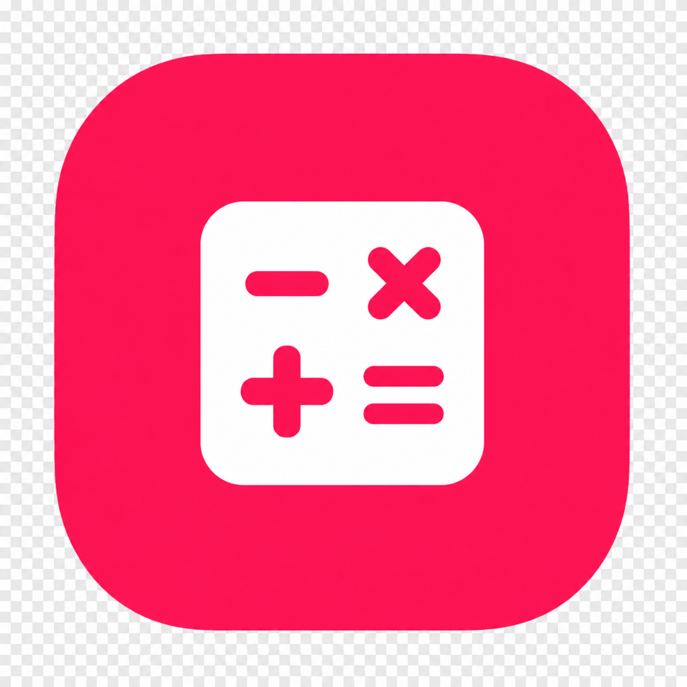
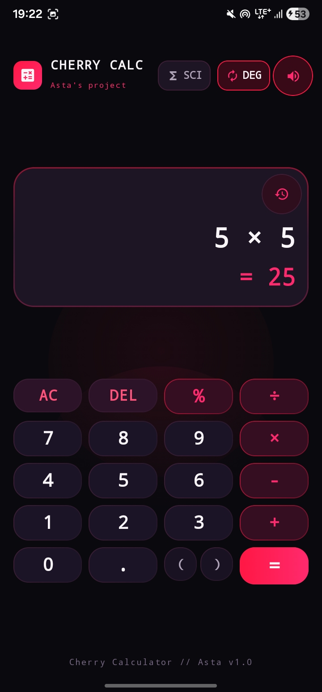
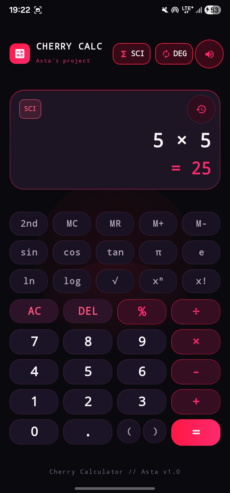
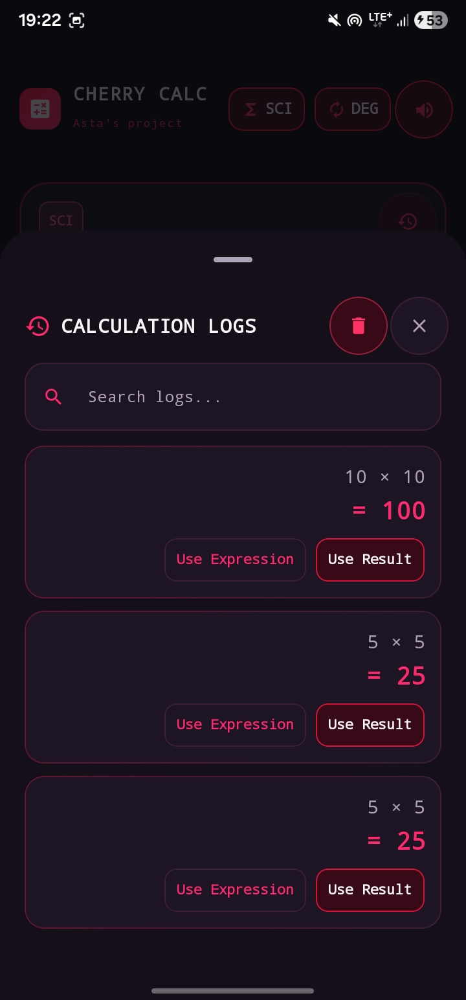

# 🍒 Cherry Calculator

> A modern, elegant, and feature-packed scientific calculator built with **Jetpack Compose** and **Material 3**, featuring a gorgeous sci-fi glassmorphic dark theme with cherry accents. 🚀✨

---

## 📱 Screenshots & UI Preview

<p align="center">
  
</p>

| Standard Calculator | Scientific Mode | Calculation Logs |
| :---: | :---: | :---: |
|  |  |  |

---

## ✨ Key Features

- 🔬 **Scientific & Basic Keypads**: Easily toggle between standard arithmetic and advanced scientific functions (`sin`, `cos`, `tan`, `ln`, `log`, $\sqrt{}$, power $x^n$, factorial $x!$, constants $\pi$ and $e$).
- ⚡ **Real-time Live Preview**: See instant calculation previews as you type expressions.
- 📐 **Angle Unit Toggle**: Seamlessly switch between Degrees (**DEG**) and Radians (**RAD**).
- 🕒 **Calculation History**: Keep track of past calculations with instant recall for expressions and results.
- 🔊 **Interactive Feedback**: Satisfying audio and haptic feedback toggles for every button press.
- 📱 **Adaptive Layouts**: Fully responsive design optimized for both compact phones and large screen tablets / foldables (split 2-pane layout).
- 🎨 **Sci-Fi Glassmorphic Theme**: Stunning dark mode aesthetic powered by custom cherry neon gradients and smooth Material 3 animations.
- 🔄 **v1.1 Rotation & Responsiveness**: Seamless full-screen landscape layout optimization for rotated phones featuring side-by-side keypads and bug fixes.

---

## 🛠️ Tech Stack & Architecture

- **UI Toolkit**: [Jetpack Compose](https://developer.android.com/jetpack/compose) & [Material 3](https://m3.material.io/)
- **Architecture**: MVVM (Model-View-ViewModel) with Kotlin `StateFlow` and unidirectional data flow.
- **Language**: 100% Kotlin
- **Evaluation Engine**: Custom robust mathematical expression evaluator supporting operator precedence, parentheses, and trigonometric angle modes.
- **State Management**: Lifecycle-aware state collection (`collectAsStateWithLifecycle`).

---

## 🚀 What's New in v1.1 🌟
- **Fixed Phone Rotation & Landscape Layout**: Rotated phones now expand into a gorgeous full-screen layout with side-by-side keypads (Scientific & Basic) for effortless 10-foot usability without scrolling.
- **Display & Result Refinements**: Removed background glow backlight and result shadow backing; preview results are now cleanly translucent until `=` is computed.
- **Calculation Logs Spacing**: Added clean padding and separation between delete and close buttons in the calculation history menu.

---

## 📂 Project Structure

```tree
com.asta.calculatorapp/
├── domain/evaluator/       # Mathematical expression evaluator & angle unit handling
├── ui/
│   ├── components/         # Reusable keypads, display panel, history sheets
│   ├── feedback/           # Sound & haptic feedback managers
│   ├── screens/            # Main CalculatorScreen & layouts
│   ├── theme/              # Color palettes, typography, and Material 3 theme
│   └── viewmodel/          # CalculatorViewModel & UiState
└── MainActivity.kt         # Entry point activity
```

---

## 🚀 Getting Started

1. **Clone the repository**:
   ```bash
   git clone https://github.com/asta-JC/Cherry-Calculator.git
   ```
2. **Open in Android Studio**:
   - Open Android Studio and select **Open an Existing Project**.
   - Navigate to the cloned `Calculatorapp` directory.
3. **Build & Run**:
   - Sync Gradle and run the app on an Android emulator or physical device (Min SDK 24+, Target SDK 34+).

---

## 📄 License

This project is developed as part of Asta's project series. Feel free to use and adapt for personal and educational use!

---

<p align="center">
  Made with ❤️ & 🍒 by Asta
</p>
